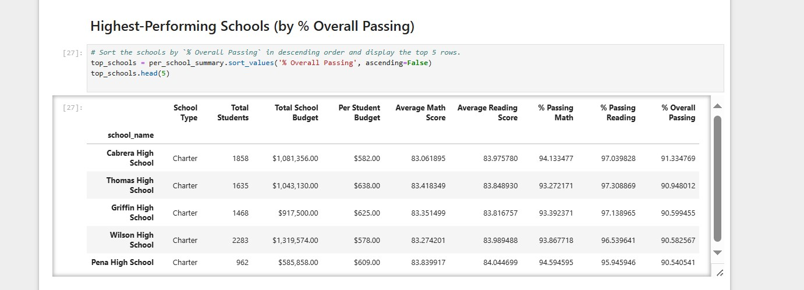

# PyCity Schools Analysis

## Website: 
[website](https://github.com/Damiomo/School-Pandas-Analysis)

## Description
A Pandas analysis is conducted on data information obtained from 15 schools.

## Table of Contents
- [Installation](#installation)
- [Usage](#usage)
- [Credits](#credits)
- [License](#license)
- [Features](#features)

- [Contact](#contact)

## Installation
Pandas, python

## Usage
run PyCitiSchools_starter.ipynb

## Credits
Damilare Omoboriowo

## License
MIT

## Features
It provides disctrict and per school data summary.  It shows the top and bottom school performance.

## Contact
If there are any questions or concerns, I can be reached at:
##### [github: Damiomo](https://github.com/Damiomo)
##### [email: domoboriowo14@gmail.com](mailto:domoboriowo14@gmail.com)
